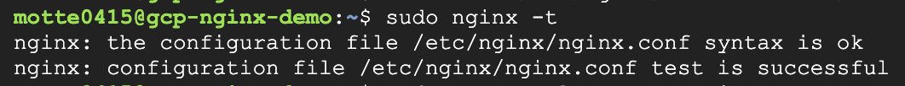

# IP Blocking with Nginx on GCP
This demo project shows how to configure IP-based access restriction on Nginx running on a GCP VM, and verify the 403 Forbidden responses through access logs.

## Tech Stack

・Cloud:GCP Compute Engine
・OS/Linux:Ubuntu 22.04
・Web Server:Nginx
・Terminal Operations:nano,curl,tail,systemctl

## Setup Procedure

### 01.Vm Instance Creation
GCP console screenshot after VM setup. 


### 02.System UPdate
```shell
sudo apt update
sudo apt upgrade -y
```


### 03.Nginx install
```shell
sudo apt install nginx -y
```


### 04.Check Nginx Status
```shell
sudo systemctl status nginx
```


### 05.Access Default Nginx Page


### 06.View Access Logs
```shell
sudo tail -f /var/log/nginx/access.log
```


### 07.Block Suspicious IPs in Nginx
```shell
deny 185.218.84.29;
deny 8.219.57.99;
deny 93.174.93.12;
allow all,
```


### 08.Test configuration success
```shell
sudo nginx -t
sudo systemctl reload nginx
```


### 09.Confirm 403 access log


## What I Learned
Through this demo project, I gained hands-on experience with fundamental infrastructure skills—from launching a virtual machine to configuring Nginx and implementing IP-based access restrictions. It was especially insightful to observe and understand how 403 errors occur by checking the logs.

### 1.Understanding Cloud and Linux Operations
・How to launch and manage a virtual machine using GCP Compute Engine
・The difference between apt update and apt upgrade and their respective purposes
・Managing services like nginx using systemctl
・Safely editing and reloading Nginx configuration files

### 2. Basics of Web Server Behavior and Log Analysis
・Installing and verifying nginx functionality on a new server
・Recognizing automatic browser requests (e.g., favicon.ico)
・How to interpret access.log (methods, status codes, user agents, etc.)
・Monitoring logs using tail -n and tail -f for real-time inspection

### Introductory Security Awareness
・Identifying suspicious traffic or bot-like behavior via logs
・Blocking malicious IP addresses using nginx deny rules
・Understanding the basic approach to hardening a public-facing Linux server

## What to Work on Next
Deepen Understanding of GCP Services
Explore core services such as VPC (Virtual Private Cloud), Firewall (traffic control), Cloud Logging (log monitoring), and IAM (access control) to gain a better understanding of cloud infrastructure setup and management
